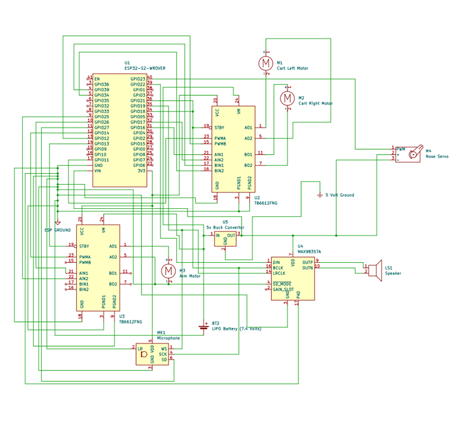

# Interactive Minecraft Villager
I completed this project for a mechatronics class. 

## Description
This project implements an interactive embedded system built around an STM32 microcontroller. The system uses an INMP411 I2S MEMS microphone to detect when a user is speaking. When speech is detected, the microcontroller generates a response by randomly stitching together audio samples stored in memory.

The generated audio is streamed out over I2S to an amplifier and speaker for playback.

While the toy is talking, several mechanical features are actuated to animate the character. The arms move, the nose wiggles, and the minecart moves in a random pattern to simulate the motion of a villager riding in a minecart.

The firmware is organized around a finite state machine (FSM) which coordinates the system behavior. The implementation runs on an RTOS-based architecture, where separate tasks handle audio generation, animation, minecart movement, and high-level system control.

## System Architecture

The system is organized into several RTOS tasks that separate different parts of the system behavior.

### Main Task

The main task tracks the finite state machine that governs the system behavior. It monitors microphone input and determines when the system transitions between states such as idle, listening, and responding.

### Audio Task

The audio task generates the villager’s responses. It randomly selects and stitches together stored audio samples and streams the resulting audio to the amplifier using the I2S interface.

### Animation Task

The animation task handles the physical animation of the character. It controls the movement of the arms and the nose while the villager is speaking.

### Minecart Task

The minecart task controls the motion of the minecart base. It randomly enables the drive motors to simulate the movement of a villager riding in a minecart, giving the toy more natural movement while it is active.

## Electronics
- ESP32 microcontroller
- 2 12 Volt Motors
- 4 ohm speaker
- MAX98357A amplifier
- 5 Volt Buck Converter
- 4 Mini Micro N20 wheels
- TB6612FNG motor controller
- INMP411 microphone
- 5 Volt Hobby Servo

### Electrical Schematic

# Lessons
We were able to validate most of the system functionality. However, final integration was limited by packaging constraints, as the electronics required two breadboards and could not be fully mounted inside the toy housing.

